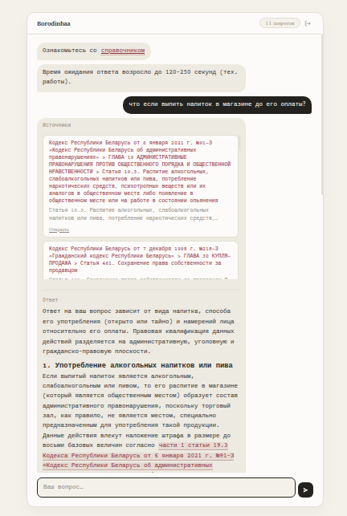
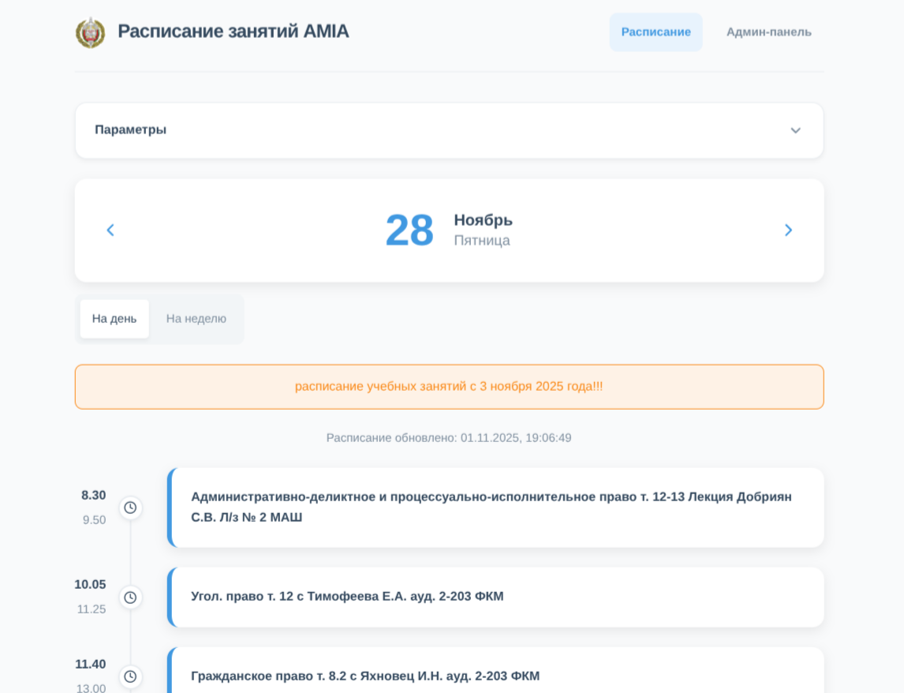
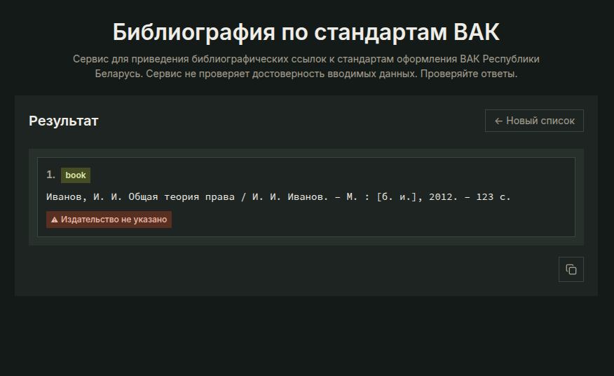
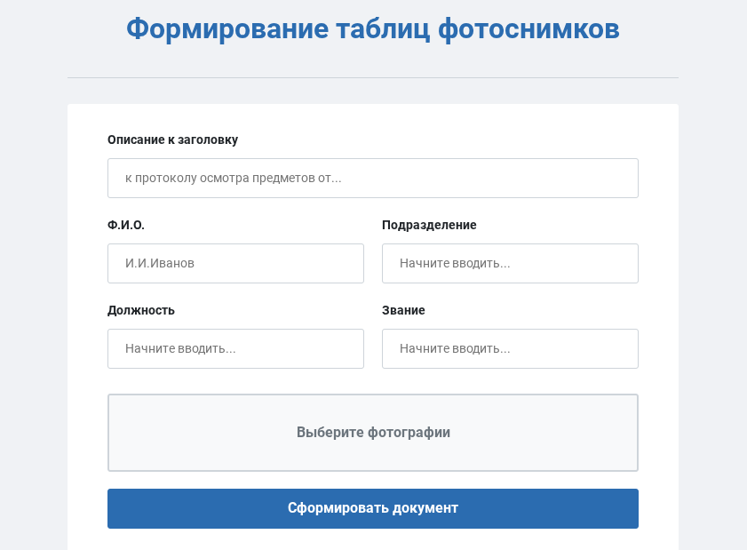

# Artyom Borodin

*Academy of the Ministry of Internal Affairs of the Republic of Belarus*

[Email](mailto:a.a.borodin@proton.me)

---

## About Me
I combine law and information technology. Currently, I am a student at the Academy of the Ministry of Internal Affairs while also working in the IT department of a metropolitan university. I build tools that make legal work faster and more accurate. 

---

## Technologies

* **Frontend & Backend:** JavaScript (Node.js), Vue, Express, Turso, SQL, GCP.
* **AI:** Gemini API, Cohere API, Qdrant, Gemini Enterprise Agent Platform (formerly Vertex AI), OpenRouter.
* **Also worked with:** Python, Flask, Pinecone, Grok API, Java, Android SDK, Firebase

---

## Projects

### ⚖️ [Borodinbaa Legal AI Assistant](https://a.a.borodin.github.io/borodinbaa-info/)
* **Status:** MVP

A RAG-based AI legal assistant. It analyzes legal acts of the Republic of Belarus and provides preliminary case qualification. Included in the state catalog of innovative developments of BelISA (2025). Exhibited at the "Great Stone" Industrial Park.

### 📅 [AMIA Schedule](https://schedule.amia.by)
* **Status:** Officially Implemented

Web service for the schedule of the Academy of the Ministry of Internal Affairs of the Republic of Belarus. Used daily by hundreds of cadets, students, and lecturers.

### 🔗 [Ссылка.бай](https://purrfectref-866165811326.us-east1.run.app/)
* **Status:** MVP

AI bibliography formatter based on the standards of the Higher Attestation Commission of the Republic of Belarus. Saves hours of manual work.

### 📷 [Photo Table Generator](https://docs-generator-866165811326.europe-west3.run.app/)
* **Status:** MVP

Automated generation of photo tables for investigative action protocols. Developed for the Investigative Committee of the Republic of Belarus.

---

## Achievements

* 🎤 **Speaker — Project Presentation**  
  Presented the "Borodinbaa" AI legal assistant at the Great Stone China-Belarus Industrial Park.
  
* 🥇 **1st Place — "The Hackathon: AI Era"**  
  Best AI-based solution, Minsk.
  
* 🛡️ **1st Place — Personal Data Protection Competition**  
  Best research paper, National Center for Personal Data Protection.
  
* 🥈 **2nd Place — IT-Challenge**  
  Republican Olympiad in Information Technology, Polotsk.
  
* ⚖️ **Winner of the "Lawmaking" Category**  
  Belarusian Student Law Olympiad, Belarusian State University.
  
* 💻 **Participant — IT-Challenge 2026**  
  Republican Olympiad in Information Technology among higher education students.
  
* 💡 **Ministerial Stage Finalist — "100 Ideas for Belarus"**  
  Presentation of the "Borodinbaa" AI legal assistant at the national level, Minsk.
  
* 🏨 **Participant — InDev Solutions Hackathon (BSU & HTP)**  
  Case: "Smart Hotel Access System".
  
* 👮 **Participant — X International Olympiad in Informatics among Cadets**  
  National stage, BSUIR.
  
* 🇷🇺 **Finalist of the Russian MIA Hackathon**  
  Big Data & AI in Law Enforcement track, Moscow.
